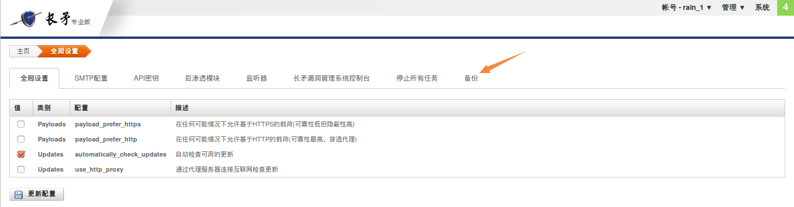
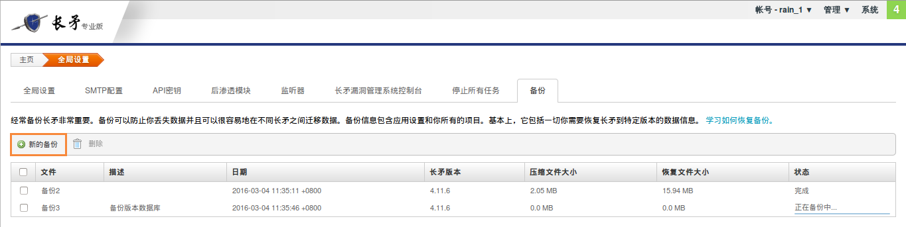
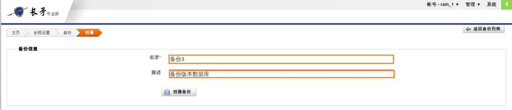
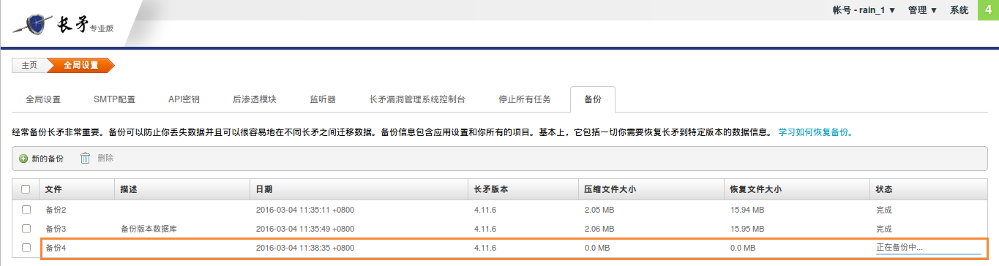
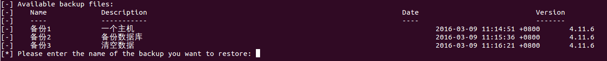
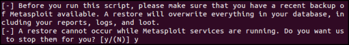
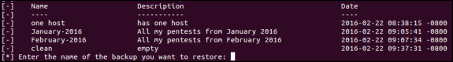
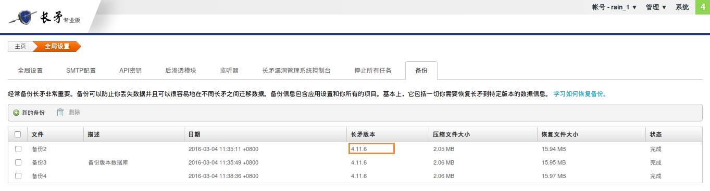

备份与恢复
==========

任何人都可能碰到硬件故障和数据丢失的情况。所以定期备份长矛数据是非常关键的。因为如果面临这种情况，会导致包含非常重要且敏感数据的项目丢失数据，从而产生巨大的负面影响。

为了防止数据丢失，应定期备份长矛以便能够:

* *修复长矛副本* — — 备份数据有助于修复长矛，这样就不会丢失配置设置和任何项目数据。
* *迁移不同的长矛服务器之间的数据* — — 如果遇到任何硬件更改或故障，长矛的多个实例之间的数据传输是非常有利的。

备份数据
--------

备份包含所有需要将长矛还原到某个特定的状态，例如应用程序设置和项目。唯一不会迁移的是软件版本。长矛实例将继续使用当前版本。

备份长矛时，所有数据库内容压缩成ZIP文件并存储在 ``/path/to/metasploit/apps/pro/backups`` 路径中。将长矛还原到特定的备份时，不会覆盖这些文件。因此只有手动删除或卸载长矛，他们才可用。

若要备份长矛数据:

1、转到“管理”-->“全局设置”

2、选择“备份”选项卡

3、单击“新的备份”按钮，显示“创建备份”页面

4、在“创建备份”的页面中输入备份文件的名称和相应的描述

5、单击“创建备份”按钮
提供清晰、简明的描述以便容易标识每份文件的内容。这对还原备份时，有多个可供选择的文件，是有帮助的。
出现备份页面时，可见已创建的备份文件。状态列将显示备份进度。需刷新页面来更新状态。备份完成后，将变为为“完成”状态。

还原备份
--------

还原将长矛服务器恢复到备份文件你内获取的状态。备份文件是独立的平台，可将数据从一个操作系统还原到另一个没有任何问题的操作系统。

还原备份文件时，备份文件内的数据将覆盖当前长矛实例中的所有内容，包括用户帐户、 战利品、 报告和日志。所有不在备份文件中的数据将丢失。

要还原备份，则必须停止所有长矛进程以修改数据库。还原数据库后，长矛服务将重启且可像往常一样使用长矛。不用担心。无需手动关闭流程，我们会在运行还原脚本时关闭它。

**在Linux系统上恢复**

若要还原备份，需从诊断的shell程序运行脚本。

如果正还原Linux系统上的 Windows 备份，需在还原文件前更改可执行的ZIPA文件权限。若要更改文件的权限，请运行以下命令::

    sudo chmod +x /opt/metasploit/apps/pro/backups/<backup file>.zip.

若要还原 Linux 系统上的备份:

1、打开终端
2、cd 切换至长矛目录::

    $ cd /opt/metasploit
	
3、sudo 运行diagnostic shell::

    /opt/metasploit$ sudo ./diagnostic_shell
	
4、bash命令行出现提示时，运行还原脚本::

    bash-4.3# ./restore
	
5、如果长矛服务仍在运行，会提示停止运行，输入Y继续。

6、当显示备份列表时，请输入需要还原的备份文件名。

7、当出现确认消息时，请输入 Y 以还原备份。备份过程可能需要几分钟。完成后，将看到"恢复完成"消息。

8、输入 exit 关闭诊断的shell。

**在Windows系统上恢复**

1、转到“C:/长矛”的目录并运行还原的bat脚本。
2、如果长矛服务仍在运行，会提示停止运行，输入 Y 继续。

3、当显示备份列表时，请输入需要还原的备份文件名。

4、当出现确认消息时，请输入 Y 以还原备份。备份过程可能需要几分钟。完成后，将看到"恢复完成"消息。

5、退出命令提示符。

**还原到长矛较早版本**

我们仅支持转发兼容性，这意味着可将备份还原到长矛的相同版本或更新版本的。例如，如果在长矛4.11.6 上创建备份文件，则无法还原较早版本的文件，如长矛4.11.5 。但是可还原到新的版本，如 长矛4.11.7。

要检查备份版本，请转到备份区并在长矛版本列中查找。

备份后重新登录
----------------

还原备份文件时，将覆盖包含用户账户在内的所有长矛实例内容。如果已将备份文件还原到不同的长矛实例，可能无法使用之前的凭据登录。如果已恢复备份文件并不再登录到 长矛，则可运行重置密码的脚本获取新凭据。

查找备份文件
------------

备份文件位于 ``/path/to/metasploit/apps/pro/backups`` 

若打算卸载 长矛，应将此目录中的备份文件复制到计算机上的不同位置。或如果想与另一个长矛实例共享备份文件，可从此位置复制。